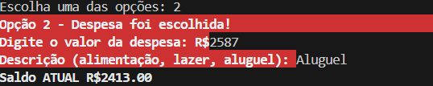
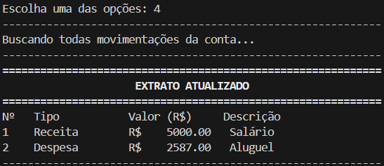
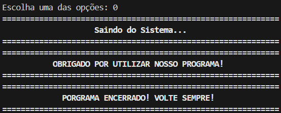

# Sistema de Controle Financeiro Pessoal via Terminal

🚧 Em desenvolvimento

Projeto desenvolvido para revisar os conceitos estudados em Python e auxiliar na organização mensal das minhas finanças pessoais.

## Funcionalidades

- Cadastro de Receitas
- Cadastro de Despesas
- Consulta de Saldo
- Extrato com histórico de movimentações
- Impede despesas maiores que o saldo
- Validação dos inputs
- Modularização das funções
- Persistência de dados em arquivo

## Tecnologias

- Python 3.13
- VS Code
- Git
- GitHub

## Como executar

```bash
git clone https://github.com/samuel-svaz-dev/sistema-de-financas
cd sistema-de-financas
python main.py
```

## O que aprendi / Desafios

Esse projeto começou simples (um loop de menu) e foi crescendo junto com o que eu ia aprendendo no curso. Alguns pontos que marcaram o desenvolvimento:

- **Modularização**: separar o código em pacotes (`apresentacao` para a interface do menu e `funcoes_calculo` para as regras de cálculo) deixou o `main.py` muito mais limpo e me obrigou a pensar em responsabilidade de cada parte do sistema, não só em "fazer funcionar".
- **Tratamento de erros**: usar blocos `try/except/finally` para validar os inputs do usuário foi meu primeiro contato real com tratamento de exceções fora de exemplos de curso — entender quando usar `finally` (por exemplo, para garantir que um arquivo seja fechado independente do que aconteça) mudou como eu penso sobre código "à prova de erro do usuário".
- **Persistência em arquivo**: migrar de dados guardados só em memória (que se perdiam ao fechar o programa) para salvar em arquivo foi o maior salto de complexidade até agora. Tive que pensar em como estruturar cada movimentação (receita/despesa) como um dicionário antes de gravar, e lidar com leitura/escrita sem corromper dados existentes.

## Próximos passos

- Aplicar conceitos de Programação Orientada a Objetos (classes como `Transacao` e `Conta`)
- Migrar a persistência de arquivo de texto para um banco de dados simples (SQLite)
- Adicionar testes automatizados das funções de cálculo
- Melhorar a interface do terminal (cores e formatação)

## Demonstração

- Menu Inicial do Terminal
  
  


- Adicionando Receita

  


- Adicionando Despesa

  


- Exibindo Extrato das Movimentações

  


- Saindo do Programa

  