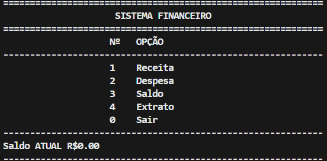
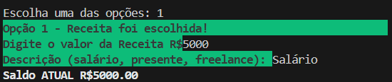

# 💰 Sistema Financeiro em Python

Sistema de controle financeiro pessoal via terminal, desenvolvido para aplicar e revisar conceitos de lógica de programação e estruturação de código em Python, com foco em auxiliar na organização financeira mensal de uma pessoa.

> Projeto pessoal de estudo, desenvolvido durante minha transição de carreira de professor de matemática para desenvolvedor backend Python.

## 📋 Sobre o Projeto

O programa simula um sistema financeiro de terminal onde o usuário pode cadastrar receitas e despesas, consultar seu saldo e visualizar um extrato completo das movimentações, com validações para impedir inconsistências (como despesas maiores que o saldo disponível).

## ⚙️ Funcionalidades

- ✅ Cadastro de receitas
- ✅ Cadastro de despesas
- ✅ Consulta de saldo
- ✅ Extrato com histórico de movimentações
- ✅ Bloqueio de despesas maiores que o saldo disponível
- ✅ Validação de inputs do usuário
- ✅ Código modularizado em funções

## 🛠️ Tecnologias

- Python 3.13
- VS Code
- Git / GitHub

## 🎯 Objetivos de Aprendizado

Este projeto foi construído para aplicar, na prática, conceitos como:

- Funções, listas, dicionários, estruturas de repetição e condicionais
- Modularização de código em múltiplos arquivos
- Construção de um fluxo de menu interativo via terminal
- Organização de um projeto Python do zero, com versionamento em Git

## 📂 Estrutura do Projeto

```
sistema-de-financas/
├── apresentacao/         # Imagens e materiais de apresentação do projeto
├── funcoes_calculo/      # Módulos com as funções de cálculo financeiro
├── main.py               # Ponto de entrada do programa (menu principal)
└── README.md
```

## ▶️ Como Executar

Não há dependências externas — apenas Python instalado na máquina.

```bash
# Clone o repositório
git clone https://github.com/samuel-svaz-dev/sistema-de-financas.git

# Entre na pasta do projeto
cd sistema-de-financas

# Execute o programa
python main.py
```

> ⚠️ **Observação:** atualmente os dados são armazenados apenas em memória durante a execução — ou seja, ao fechar o programa, as informações cadastradas são perdidas. A persistência em arquivo está nos próximos passos do roadmap.

## 🖼️ Demonstração

**Menu Inicial do Terminal**



**Cadastro de Receita**



**Extrato de Movimentações**


## 🚧 Roadmap / Próximos Passos

- [ ] Persistência de dados em arquivo
- [ ] Refatoração para Programação Orientada a Objetos (POO)
- [ ] Categorização de despesas e receitas
- [ ] Testes automatizados

## 👤 Autor

**Samuel Vaz**

Professor de matemática em transição de carreira para desenvolvimento backend Python.

[GitHub](https://github.com/samuel-svaz-dev) · [LinkedIn](#)
